# Advanced creation mode

This guide shows a detailed example of creating a model with the advanced creation mode for a credit card fraud detection case study.

## Example case study: credit card fraud detection

The example uses the Kaggle dataset "Credit card fraud detection dataset" to build a binary classification model that predicts whether a transaction is fraudulent.

This scenario is useful for advanced mode because it usually requires careful preprocessing, class imbalance handling, and model tuning.

### 1. Start a new project

Open the Laredo web interface and create a new project in Advanced mode.

- Select the Advanced creation mode.
- Choose the problem type as Classification.
- Name the project clearly, for example "credit-card-fraud-advanced".

=== "Home screen"

    

=== "Model creation"

    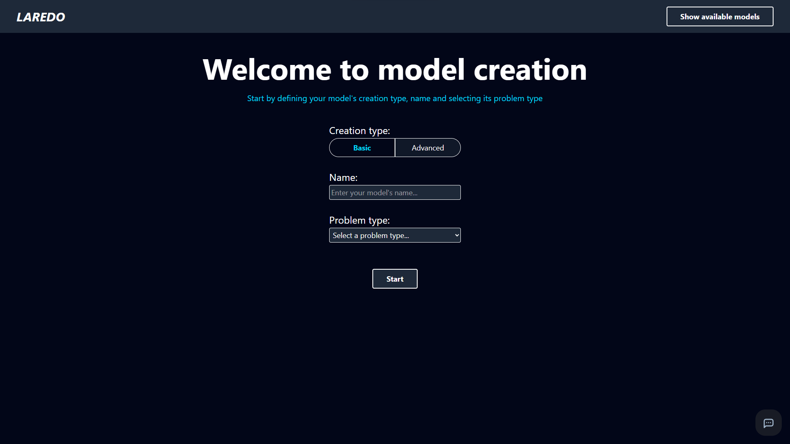

### 2. Upload and validate the dataset

Upload the CSV file containing the credit card transaction data and review the detected columns.

- Confirm that the target column represents the fraud label.
- Review the dataset preview to verify that the transaction features and labels are loaded correctly.
- Check the inferred data types for the numeric and categorical columns.

=== "Upload"
    
    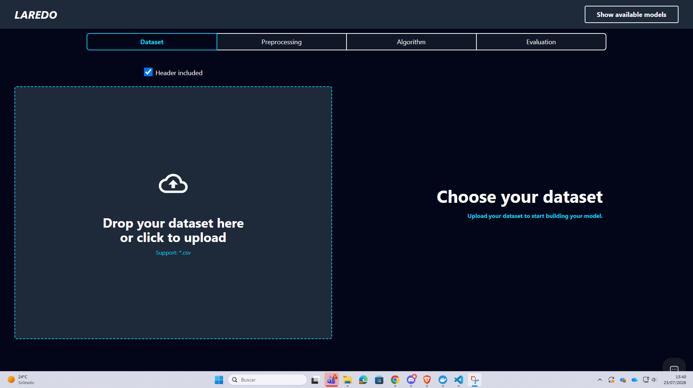

=== "Preview"

    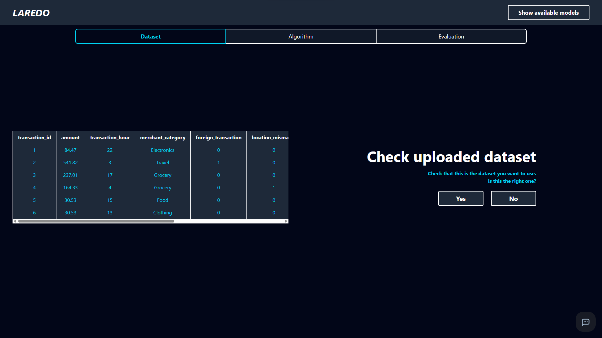

=== "Data types"
    
    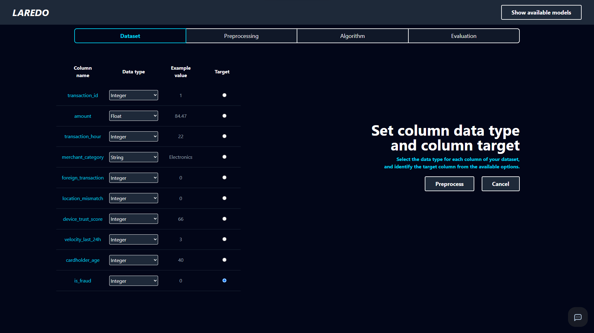

### 3. Configure a preprocessing pipeline

For a fraud detection use case, it is common to adjust the preprocessing pipeline to handle class imbalance and to prepare the transaction features for model training.

- Remove unneeded columns if necessary.
- Add preprocessing methods such as scaling or transformations.
- Combine the preprocessing steps into a pipeline that can be reused during training.

=== "Drop columns"

    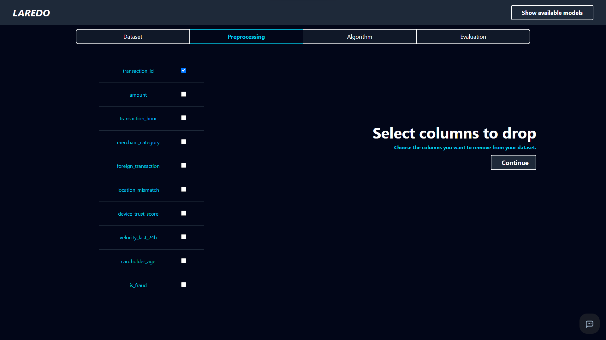

=== "Preprocessing"

    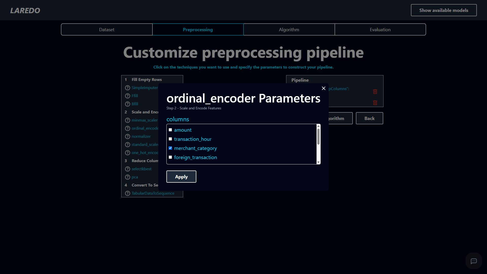

=== "Pipeline"

    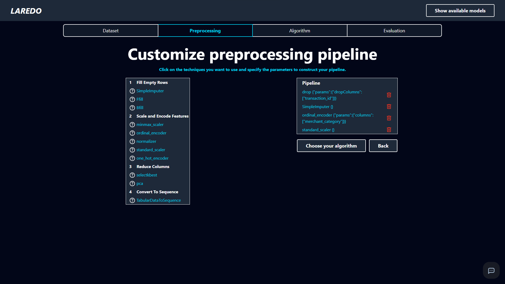

### 4. Select the model and tune it

Choose the machine learning algorithm and configure the training parameters for the fraud classification task.

- Select a model family such as a tree-based classifier or another suitable algorithm.
- Tune the hyperparameters to balance sensitivity and precision.
- Start the training run and review the training progress.

=== "Algorithm"

    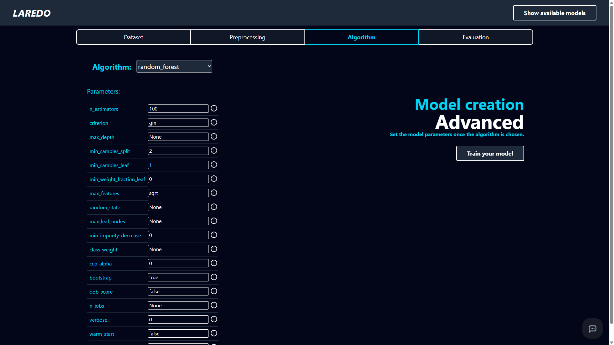

=== "Training"

    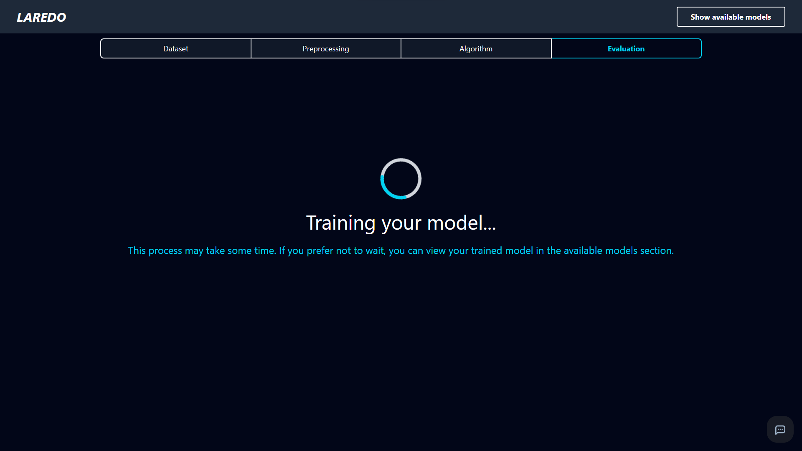

### 5. Review the evaluation and deploy the best model

After training, review the evaluation report and compare candidate models before deploying one.

- Inspect the evaluation metrics to assess fraud detection performance.
- Review the model details and version information.
- Deploy the selected version to make it available for inference.

=== "Evaluation"

    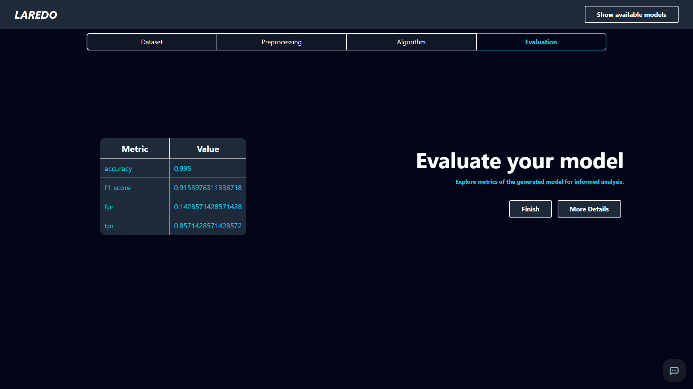

=== "Models"

    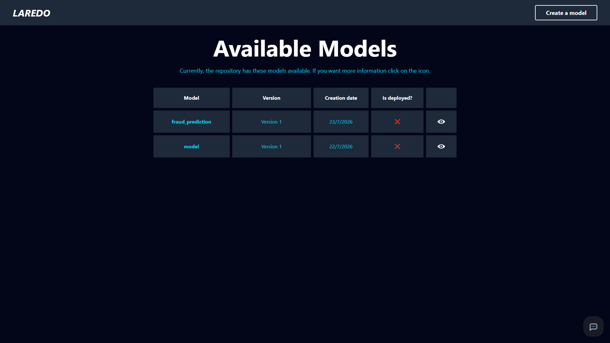

=== "Details"

    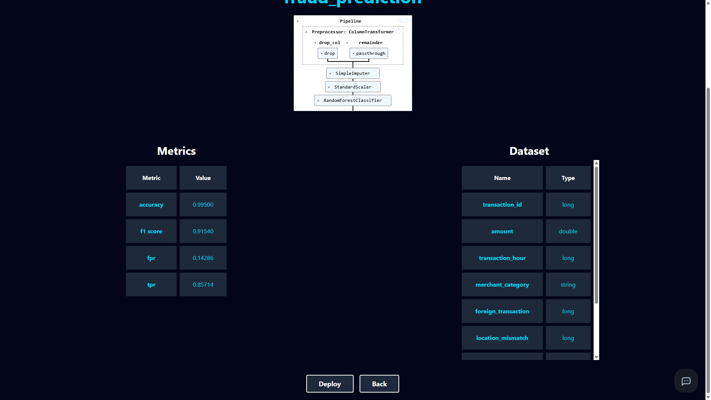

=== "Details 2"

    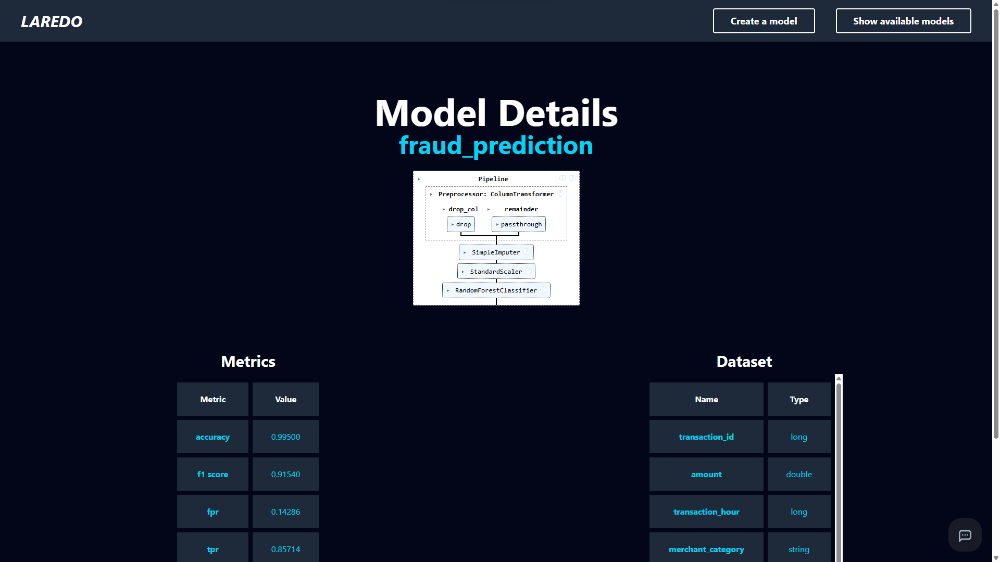

=== "Deploy"

    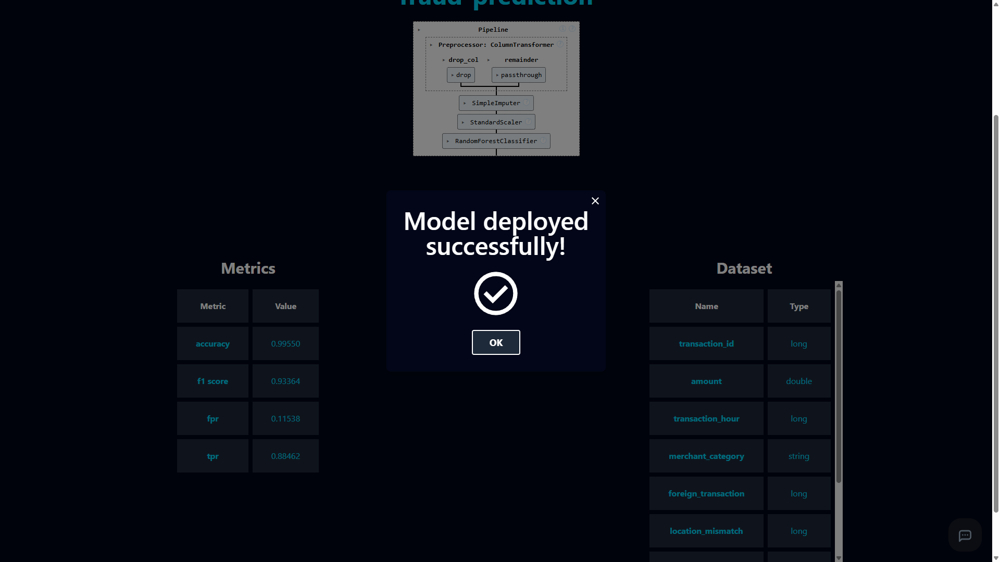

=== "Endpoints"

    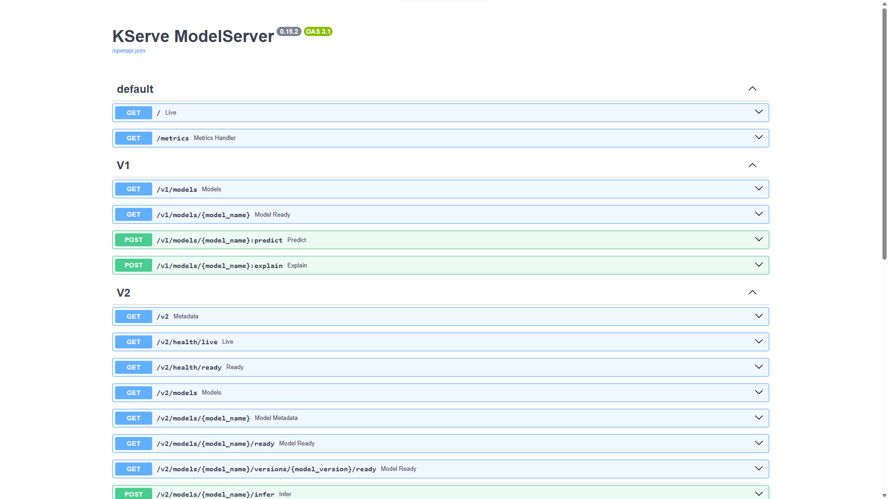

## When to use this mode

Choose Advanced mode when you need greater control over preprocessing, algorithm selection, and hyperparameter tuning, especially for complex tasks such as fraud detection, anomaly detection, or other imbalanced classification problems.
