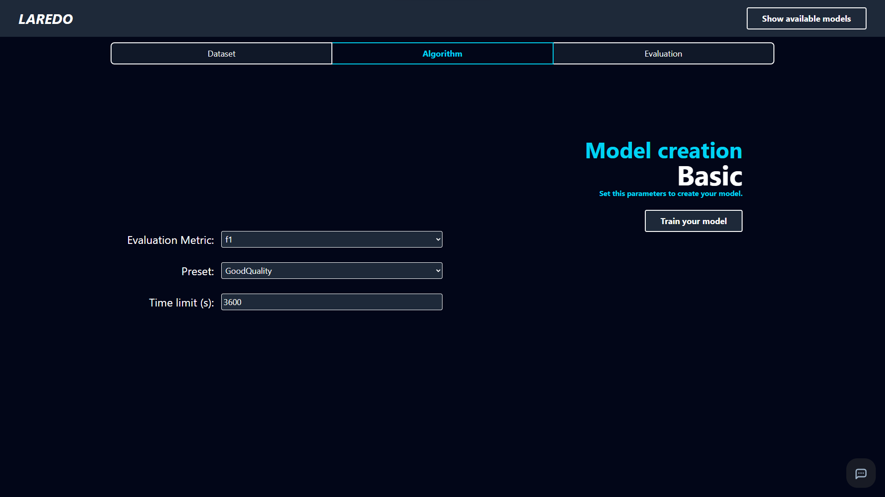
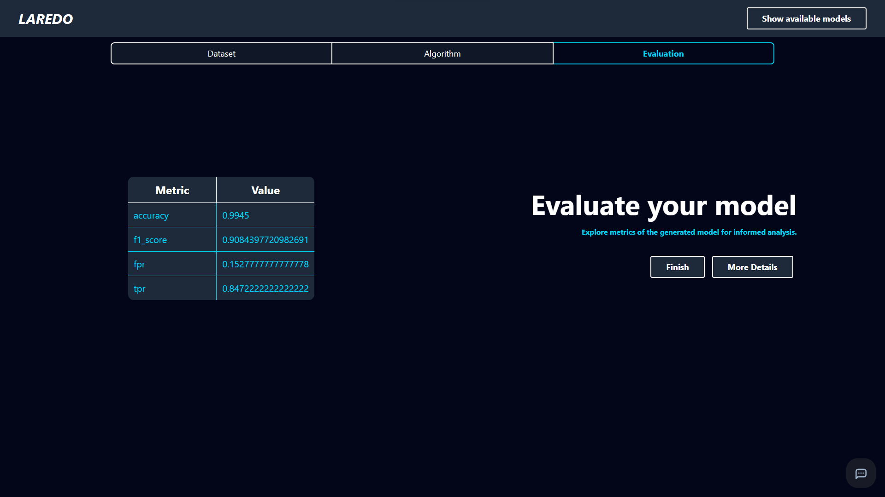
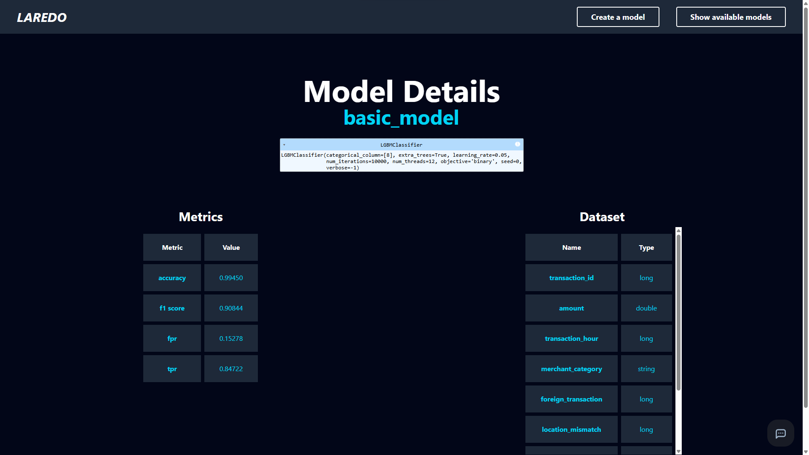

# Basic creation mode

This guide shows a simple example of creating a model with the basic creation mode.

## Example: binary classification

Use the basic mode when you want a guided workflow for a standard task such as predicting customer churn.

### 1. Start a new project

- Open the Laredo web interface.
- Choose Create model.
- Select Basic mode and then a problem type such as Classification.
- Give the project a clear name, for example "customer-churn-basic".

### 2. Upload and review the dataset

- Upload a CSV file containing the input features and the target column.
- Confirm the target variable and the detected data types.
- Review the automatic suggestions and adjust them if needed.

=== "Upload"
    
    

=== "Preview"

    

=== "Data types"
    
    

### 3. Choose the training parameters

- Indicate the Preset (Expected quality and complexity of the model)
- Choose the validation metric.
- Set a time limit for the training process.

### 4. Review and deploy

- Inspect the evaluation metrics and model summary.
- Deploy the version that meets the expected quality threshold.

=== "Evaluation"

    

=== "Models"

    

=== "Details"

    

=== "Deploy"

    

=== "Endpoints"

    

## When to use this mode

Choose basic mode for first experiments, fast onboarding, or any scenario where you want a shorter path with fewer configuration decisions.
